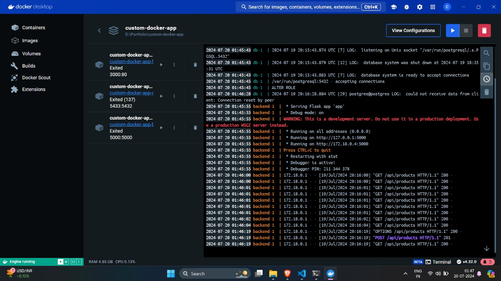
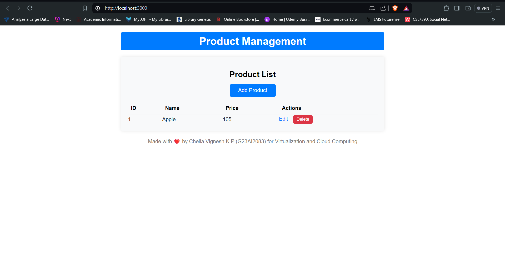

# Custom Docker App

This repository contains a sample web application deployed using Docker containers, with Docker images created from scratch. The project includes a backend service using Flask, a frontend service using React, and a PostgreSQL database.

## Author
**Name:** [Chella Vignesh K P (G23AI2083)](https://github.com/ChellaVigneshKP)

**Roll Number:** G23AI2083


## Table of Contents
1. [Introduction](#introduction)
2. [Application Functionality](#application-functionality)
3. [Steps Followed](#steps-followed)
    - [Start Docker Engine](#1-start-docker-engine)
    - [Create Base Ubuntu Root Filesystem](#2-create-base-ubuntu-root-filesystem)
    - [Rootfs.tar.gz](#3-rootfstargz)
4. [Docker Images Creation](#docker-images-creation)
    - [Backend Dockerfile](#backend-dockerfile)
    - [Frontend Dockerfile](#frontend-dockerfile)
    - [Postgres Dockerfile](#postgres-dockerfile)
    - [entrypoint.sh](#entrypointsh)
5. [Docker-Compose Configuration](#docker-compose-configuration)
6. [Running the Application](#running-the-application)
7. [References](#references)

## Introduction
This project demonstrates the deployment of a web application using custom Docker images created from scratch. The backend service is built with Flask, the frontend with React, and PostgreSQL is used as the database. The Docker images are built from scratch without using any existing Docker images, ensuring a tailored and lightweight environment.

## Application Functionality
- **Backend (Flask):** Provides a RESTful API for the application.
- **Frontend (React):** Offers a user interface to interact with the backend services.
- **Database (PostgreSQL):** Stores application data.

## Steps Followed
To set up and run the application, follow these steps:

### 1. Start Docker Engine
### 2. Create Base Ubuntu Root Filesystem
```bash
docker run --name ubuntu-rootfs -it ubuntu:24.04 bash
apt-get update
apt-get install -y debootstrap
debootstrap --variant=minbase focal /rootfs http://archive.ubuntu.com/ubuntu/
tar -C /rootfs -czf /rootfs.tar.gz .
exit
docker cp ubuntu-rootfs:/rootfs.tar.gz .
```
### 3. Rootfs.tar.gz
- Placed rootfs.tar.gz in all modules of code
## Docker Images Creation
### Backend Dockerfile
- Refer to the backend/Dockerfile for the complete Dockerfile code.
### Frontend Dockerfile
- Refer to the frontend/Dockerfile for the complete Dockerfile code.
### Frontend Dockerfile
- Refer to the frontend/Dockerfile for the complete Dockerfile code.
### Postgres Dockerfile
- Refer to the postgres/Dockerfile for the complete Dockerfile code.
### entrypoint.sh
- Refer to the postgres/entrypoint.sh for the complete script.
## Docker-Compose Configuration
- Refer to the postgres/entrypoint.sh for the complete script.
## Running the Application
```bash
docker-compose up --build
```
## References
- [Docker Documentation](https://docs.docker.com/)
